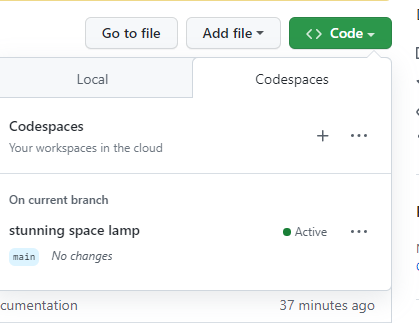
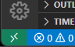
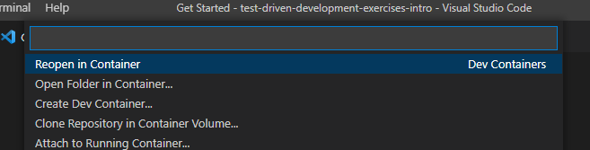

# Sagely Introduction to TDD Exercises

## Development Environment Setup

### GitHub Code Spaces
1. Log into GitHub
1. Navigate to the
   [test-driven-development-exercises-intro](https://github.com/growsagely/test-driven-development-exercises-intro)
   repository
1. Open Codespaces
   

### Local Development Container
Requirements
- Git
- [Visual Studio Code](https://code.visualstudio.com/)
- [Docker](https://docs.docker.com/get-docker/)

1. Install the [Dev
   Containers](https://marketplace.visualstudio.com/items?itemName=ms-vscode-remote.remote-containers)
   Visual Studio Code plugin.
1. Clone the exercise repository
    ``` bash
    git clone https://github.com/growsagely/test-driven-development-exercises-intro.git
    ```
1. Open the cloned folder with Visual Studio Code
1. Click the `Remote Window` button in lower left hand corner of the Visual
   Studio Code window.
   
1. Select `Reopen in Container` from the select menu.
    
1. Be patient, the first time loading the container may take several minutes.
   Subsequent loads will be much faster.
1. Press Ctrl+Shift+\` to open a terminal window
1. Type `npm run test:watch` to auto run the test suite any time a file changes.
